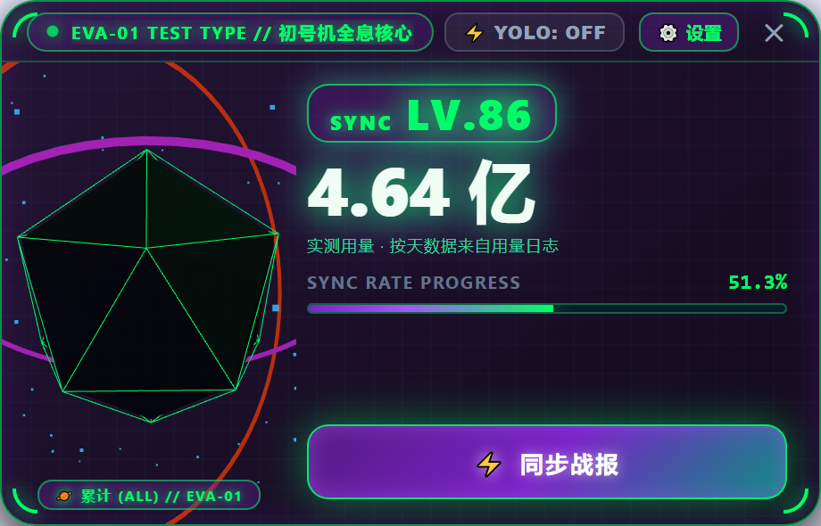
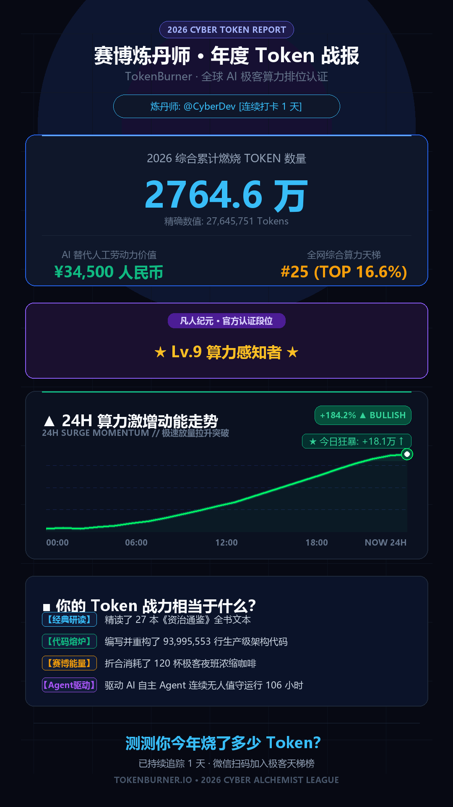

# TokenBurner 🔥

> **The 3D Holographic AI Token HUD & Cyber War Report Generator for Vibe Coders.**  
> Track, visualize, and celebrate your AI token consumption across Cursor, GitHub Copilot, DoubaoWork, Antigravity, and domestic AI IDEs with zero API keys and 100% local privacy.

[](LICENSE)
[](https://python.org)
[](https://threejs.org)
[](https://microsoft.com)
[](#privacy--security)

---

## 🌟 Visual Showcase

<div align="center">
  <p><b>✨ Real-Time 3D Holographic Floating Desktop HUD (EVA-01 Unit Theme)</b><br/>
  <sub>Live total, current level, and a provenance line that states whether the headline number was <i>measured</i> or merely <i>guessed</i>.</sub></p>
  
  <br/><br/>
  <p><b>📊 1080×1920 Cyber War Report Poster</b><br/>
  <sub>Drawn from your own daily token deltas — the curve is your real burn history, not a decorative stock chart.</sub></p>
  
  <br/><br/>
  <sub>Both images are rendered from the real code on a real machine — no mock-ups, no lorem-ipsum numbers.</sub>
</div>

---

## 🚀 Why TokenBurner?

In the era of **Vibe Coding**, every prompt, agent trajectory, and refactored function burns AI tokens. Whether you use **Cursor**, **GitHub Copilot**, **Antigravity**, or **DoubaoWork**, keeping track of your cumulative compute power should be thrilling, beautiful, and effortless.

TokenBurner acts as your desktop's cybernetic companion:
- **Zero API Key Requirement**: No credit card or API tokens needed. TokenBurner reads the usage records and local session caches your desktop tools already write.
- **100% Local & Privacy-First**: No code, prompts, or personal telemetry are ever transmitted to any remote server.
- **Honest Numbers**: every figure is labelled *verified* (from a real usage log) or *estimated* (from file size). See [Data Accuracy](#-data-accuracy--verified-vs-estimated).
- **桌宠级 3D 全息 HUD**: A frameless, hardware-accelerated WebGL holographic crystal that floats on your desktop with live particle bursts and real-time token counters.
- **年度赛博战报 (Cyber War Report)**: Generate 1080x1920 social posters with real burn-history curves, a 100-level stage progression, and provenance-labelled benchmarks.
- **No Global Leaderboard — By Design**: TokenBurner has no backend, so it will never invent a fake "global rank". Progression is 100% local (see [Level System](#-level-system)); a real cross-user leaderboard is left to the community.

---

## ⚡ Supported AI Tools & IDEs

TokenBurner internally scans and aggregates compute metrics across:

| Platform / IDE | Data Source | Token Discovery |
| :--- | :--- | :--- |
| **Tencent WorkBuddy** | `~/.workbuddy/projects/**/*.jsonl` | **Verified** — per-request `usage` records |
| **Claude Code CLI** | `~/.claude/projects/**/*.jsonl` | **Verified** — per-request `usage` records |
| **Codex CLI** | `~/.codex/sessions/**/*.jsonl` | **Verified** — `token_count` events |
| **GitHub Copilot** (WinApp & CLI) | `~/.copilot/session-state/` events | Estimated (JSONL size) |
| **DoubaoWork (豆包工作台)** | `%LOCALAPPDATA%\DoubaoWork` | Estimated (LevelDB chat logs) |
| **Antigravity** | `~/.gemini/antigravity/brain/` | Estimated (transcripts) |
| **Cursor** | `%APPDATA%\Cursor\User\globalStorage` | Estimated (SQLite `state.vscdb`) |
| **ByteDance Trae** | `%APPDATA%\Trae\User\globalStorage` | Estimated (SQLite `state.vscdb`) |
| **Alibaba Qoder / 通义灵码** | `~/.lingma`, `~/.qoder`, Code storage | Estimated (conversation cache) |
| **Baidu Comate (文心快码)** | `~/.comate` | Estimated (completion logs) |
| **CodeGeeX (智谱)** | `~/.codegeex` | Estimated (workspace history) |
| **Windsurf & Claude Code CLI** | `%APPDATA%\Windsurf` | Estimated (Cascade DBs) |

Adding a **verified** source is the single highest-value contribution: if your
tool writes per-request token counts anywhere on disk, wire it into
`get_usage_ledger()` in `src/scanner.py` and the whole app gets more accurate.

---

## 🎮 Key Features

### 1. 3D Holographic Desktop Core (Three.js + WebView2)
- **EVA-01 Test Type & Quantum Cyan**: Switch between EVA Toxic Purple-Green or Cyberpunk Cyan themes with OS-level hardware-accelerated rounded corners.
- **Reactive Particle Burst**: Every time new tokens are burned, neon particles surge through the 3D orbit rings.
- **Dynamic Period Switching**: Click the core to switch between **Total (🪐 ALL)**, **30-Day (🗓️ MONTH)**, **7-Day (📅 WEEK)**, and **24-Hour (⚡ TODAY)** stats.

### 2. YOLO Auto-Approver — opt-in, whitelisted, dry-run by default
A screen-scraping clicker that presses confirmation buttons for you. It is **off
until you configure it**, and it is deliberately guarded:

- **Dry-run by default.** Out of the box it only *detects and logs*; the mouse
  never moves. You have to explicitly switch it to live mode.
- **Whitelist-gated.** It never acts unless the focused window's process (or
  title) is on your allow-list. An empty whitelist means "click nothing".
- **Scoped capture.** The screenshot is cropped to the focused window, so a
  template physically cannot match in another application.
- **Rate-limited.** Cooldown, per-minute and per-session caps.
- **Audited.** Every hit *and every refusal* is appended to
  `%APPDATA%\TokenBurner\yolo_audit.jsonl` with the window, template, score and
  reason.

> ⚠️ **It cannot tell a safe prompt from a destructive one.** No amount of
> template matching can. It clicks a button in a window you allowed; you are
> responsible for what that button does. Do not enable it on a terminal you
> leave unattended with elevated privileges.

### 3. Cyberpunk War Report Poster
- Instant generation of a 1080x1920 poster featuring:
  - **100-Level Stage Progression**: 10 stages of 10 levels, from *引信 FUSE* to *奇点 SINGULARITY* (see [Level System](#-level-system)).
  - **Real Burn-History Curve**: plotted from your own daily token deltas - not a hard-coded "surge" shape.
  - **Provenance-Labelled Figures**: the headline number states whether it came from a real usage log or a file-size estimate; equivalences are derived from output volume, not from the raw total.

---

## 🎮 Level System

Levels are the only progression signal in TokenBurner. They are computed locally
from your cumulative token count — no account, no server, no leaderboard.

`LEVELS_PER_STAGE = 10`, `MAX_LEVEL = 100`, and the token thresholds grow
geometrically (`100,000 × 1.07^(n-1)` accumulated).

| Stage | Levels | Title | Token range |
| :--- | :--- | :--- | ---: |
| 1 | Lv.1-10 | 引信 FUSE | 0 - 119.8 万 |
| 2 | Lv.11-20 | 火种 EMBER | 138.2 万 - 373.8 万 |
| 3 | Lv.21-30 | 炉火 FORGE | 410.0 万 - 873.5 万 |
| 4 | Lv.31-40 | 熔炉 FURNACE | 944.6 万 - 1856.4 万 |
| 5 | Lv.41-50 | 反应堆 REACTOR | 1996.3 万 - 3790.0 万 |
| 6 | Lv.51-60 | 聚变 FUSION | 4065.3 万 - 7593.6 万 |
| 7 | Lv.61-70 | 恒星 STAR | 8135.2 万 - 1.51 亿 |
| 8 | Lv.71-80 | 超新星 SUPERNOVA | 1.61 亿 - 2.98 亿 |
| 9 | Lv.81-90 | 星云 NEBULA | 3.19 亿 - 5.87 亿 |
| 10 | Lv.91-100 | 奇点 SINGULARITY | 6.29 亿 - 11.57 亿 |

> The stage names follow what the app is named after — combustion, then
> nucleosynthesis: a fuse lights an ember, the ember feeds a forge, the forge
> melts into a furnace, the furnace drives a reactor, the reactor fuses, and a
> star ends in a singularity.

Tuning the ladder is a one-line change in `src/progression.py`:

```python
BASE_XP   = 100_000   # tokens for Lv.1 -> Lv.2
XP_RATIO  = 1.07      # per-level multiplier
MAX_LEVEL = 100
```

---

## 🛠️ Quick Start (30 Seconds)

### Prerequisites
- Windows 10 / 11 (64-bit)
- Python 3.10 or higher
- Microsoft Edge WebView2 (pre-installed on Windows 10/11)

### Installation

1. **Clone the repository**:
   ```bash
   git clone https://github.com/k114413450-stack/TokenBurner.git
   cd TokenBurner
   ```

2. **Install dependencies — one double-click, no terminal needed**:
   ```
   setup.bat
   ```
   It creates a private virtualenv in `.venv\` beside the project and
   pip-installs `requirements.txt` into it (~70 MB, a few minutes on a slow
   connection). Nothing outside the project folder is touched, and it is
   safe to run twice.

   The equivalent terminal commands, if you prefer:
   ```bash
   python -m venv .venv
   .venv\Scripts\python -m pip install -r requirements.txt
   ```
   A plain global `pip install -r requirements.txt` also works, but then the
   launcher follows whichever `python` happens to be first on your PATH.
   The venv makes that deterministic and keeps your system Python clean.

3. **Launch TokenBurner**:
   ```
   run_hud_3d.bat            :: double-click — silent, no console window
   run_hud_3d.bat debug      :: from a terminal — keeps the traceback visible
   ```

### Troubleshooting

**`pywebview is not installed for any Python on this machine`**
(older builds said `Missing Python packages.`)

Nothing is broken — step 2 simply has not run yet. Double-click
`setup.bat`. Or just re-run the launcher: it detects this exact situation,
tells you which interpreter it found, and offers to install for you.

**The HUD flashes and disappears.**
Run `run_hud_3d.bat debug` from a terminal so the traceback stays on
screen. The usual cause is a missing Microsoft Edge WebView2 Runtime —
check whether `C:\Program Files (x86)\Microsoft\EdgeWebView\Application`
exists. If it does not, install the Evergreen WebView2 Runtime from
<https://developer.microsoft.com/microsoft-edge/webview2/>.

**Setup says it succeeded but the HUD still will not start.**
Delete the `.venv\` folder and run `setup.bat` again — a half-finished
install is the usual reason.

---

## 📊 Data Accuracy — Verified vs. Estimated

Every figure carries one of two labels, and the UI shows which:

| Tier | Meaning | Source |
| :--- | :--- | :--- |
| **Verified** | Real per-request API usage | The tool's own session log, e.g. WorkBuddy writes `inputTokens` / `outputTokens` / `cached_tokens` per request into `~/.workbuddy/projects/**/*.jsonl` |
| **Estimated** | Inferred from conversation file size (`bytes / 3.5`) | Tools that keep no usage ledger |
| **Manual** | A number you typed into `config.json` (`web_tokens` / `api_tokens`) | You — it is neither measured nor inferred, it is a claim |

The three tiers are kept separate on purpose. Manual entries used to be summed
into `estimated_tokens`, which let a hand-typed figure inherit the credibility
of a size-based inference; they now carry their own `manual` tier and are
labelled `⚠ 手填` in the HUD and on the poster, so a typed number can never be
mistaken for a measured one. Leave `web_tokens` and `api_tokens` at `0` unless
you are deliberately padding the display.

An earlier version applied the size heuristic to *every* `.db/.json/.log` file
under a tool's data directory. Measured on a real WorkBuddy install (2.6 GB,
60 k files), 94.8 % of the counted bytes were installed runtimes, IDE caches,
telemetry traces and logs — and the resulting total (348.5 M) happened to land
within 20 % of the true figure (421.2 M). The two errors cancelled: the junk
inflated the number, while the transcripts under-reported it ~29× because a
transcript stores each message once while the API re-sends the whole context on
every request (a 98.3 % cache-hit rate). Both causes are now fixed.

Verified parsing is incremental — transcripts are append-only, so only newly
appended bytes are read — and the daily history is built from the real
per-request timestamps rather than from sampled totals, so the poster's curve is
real even if the HUD was never left running.

Cost is cache-aware. A flat per-token rate is meaningless when 98 % of input is
served from the provider's prompt cache, so `config.json` carries separate fresh
input / cached input / output rates. They are an **assumption, not a bill** —
TokenBurner has no access to your provider's pricing. Edit them to match yours.

---

## 🔒 Privacy & Security

- **No Remote Telemetry**: TokenBurner does not possess any cloud backend. All metrics are calculated directly on your local CPU.
- **Internal Recognition Only**: Your exact tools and workflows remain your secret. The user interface and exported posters celebrate your pure token power without exposing your underlying tool stack.
- **Read-Only Local Scanning**: TokenBurner only reads local session files — usage records and file sizes — and never modifies your IDE's internal state. Its own writes are limited to `%APPDATA%\TokenBurner` (config, daily history, poster, YOLO audit log).
- **The YOLO auto-approver moves your mouse.** That is the one feature that acts on your machine rather than reading it. It is off by default, dry-run by default, whitelist-gated and fully audited — see [Key Features](#-key-features).

---

## 🧪 Testing

```bash
python -m unittest discover -s tests -v
```

38 tests, no network, no mouse movement. They cover the usage ledger (duplicate
encodings, partial writes, truncation, incremental vs. cold-start agreement,
cache-aware cost, provenance labels, manual-vs-estimated tier separation) and
the YOLO safety gates (whitelist, window geometry, confidence thresholds both
ways, absolute click coordinates, rate limits, capture isolation). The vision
tests run real `cv2.matchTemplate` against a synthetic screen with `pyautogui`
stubbed, so they never touch your mouse.

Every case in there is one that actually broke during development — the ledger
is the core of the app and it is easy to get subtly, silently wrong.

---

## 🤝 Contributing

Community contributions are warmly welcomed! You can help by:
- Adding support for more AI coding assistants and IDEs in `src/scanner.py`.
- Designing new 3D Three.js themes (e.g. Gundam, Matrix, Retro Synthwave) in `src/hud_3d.html`.
- Porting the desktop window manager to macOS and Linux.
- **Retuning the level ladder** in `src/progression.py`, or proposing a better
  stage naming scheme.
- **Building a real leaderboard** — this is explicitly *not* included. If you
  want one, add it as an opt-in module with a real backend and an explicit
  consent screen. Please keep `src/progression.py` offline-only, and never ship
  simulated/placeholder numbers as if they were real.

### Regenerating the README images

The two screenshots at the top are generated, not hand-captured — please keep
them that way, so they can never drift away from what the code actually does:

```bash
pip install playwright && playwright install chromium   # dev-only dependency
python tools/render_previews.py                         # both images
python tools/render_previews.py --manual 92765          # preview a config entry
```

It pulls the real numbers from `scanner.get_full_stats()`, stubs the pywebview
bridge that `hud_3d.html` reads from, and writes `assets/hud_preview.png` and
`assets/war_report_preview.png`. If you change the HUD layout or the poster,
re-run it in the same commit.

---

## 📄 License

This project is licensed under the [MIT License](LICENSE).
